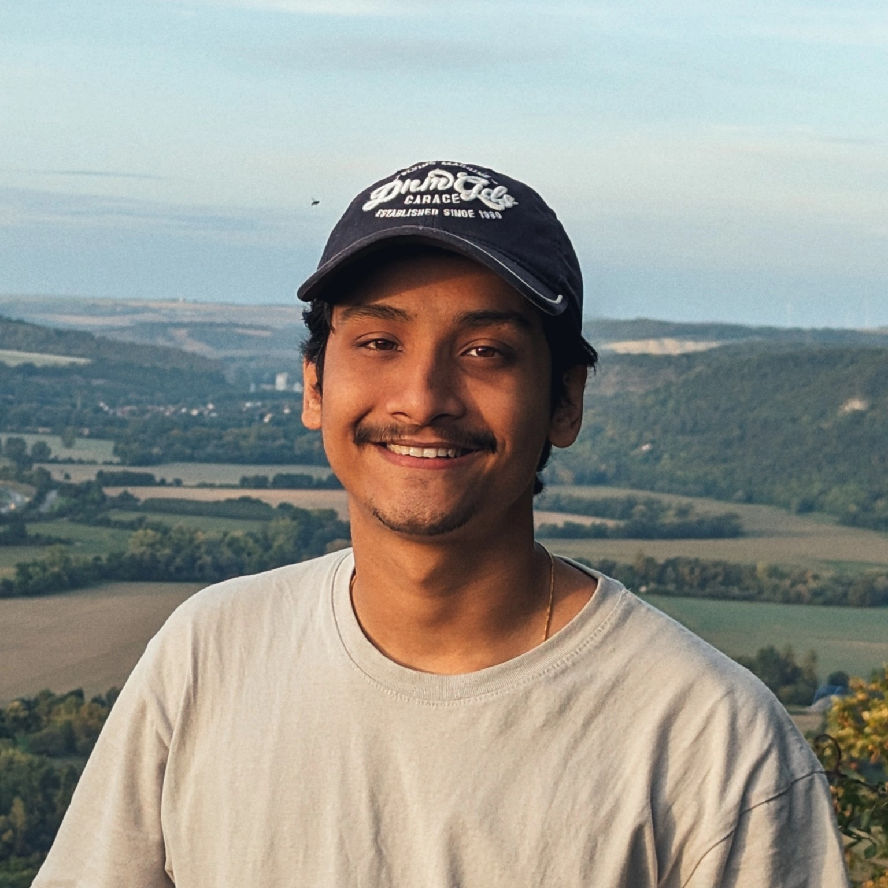

<aside class="home-sidebar">


</aside>

<h1>Hi, I am Prasoon!</h1>

I am a PhD student in [Dr. Melike Dönertaş's](https://www.leibniz-fli.de/research/research-groups/associated-research-groups/d%C3%B6nertas-group) group at the [Leibniz Institute on Aging – Fritz Lipmann Institute](https://www.leibniz-fli.de/), working on the systems biology of aging.

My research interests lie at the interface of **machine learning, dynamical systems modeling, and evolutionary theory of aging**, with a focus on developing biologically and mechanistically grounded frameworks for understanding aging.

I recently completed my master's in computational physics at [Friedrich-Schiller-Universität Jena](https://www.uni-jena.de/), where I developed [`mlgw_bns_HOM`](https://github.com/ppandey10/mlgw_bns_HOM), a neural network-driven frequency-domain waveform generator for binary neutron star mergers.

